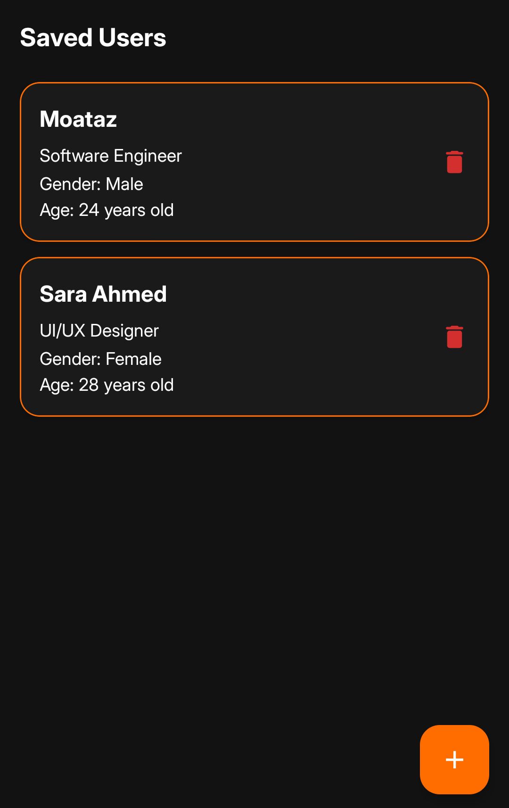

## Features

- Input screen to add user info (name, age, job title, gender)
- Saved in local database using Room
- Display screen shows all saved users
- Responsive design using Material 3
- MVVM Clean Architecture

## UI/UX

- UI inspired by Madarsoft color pallette and logo
- Displays users first (if any) then add new users with FAB
- Lightweight custom app icon

## Time Taken

Total time: **~ 5 hours**

## Screenshots

  
  
  
  

## Tech Stack

- Kotlin
- Room Database,
- Material 3
